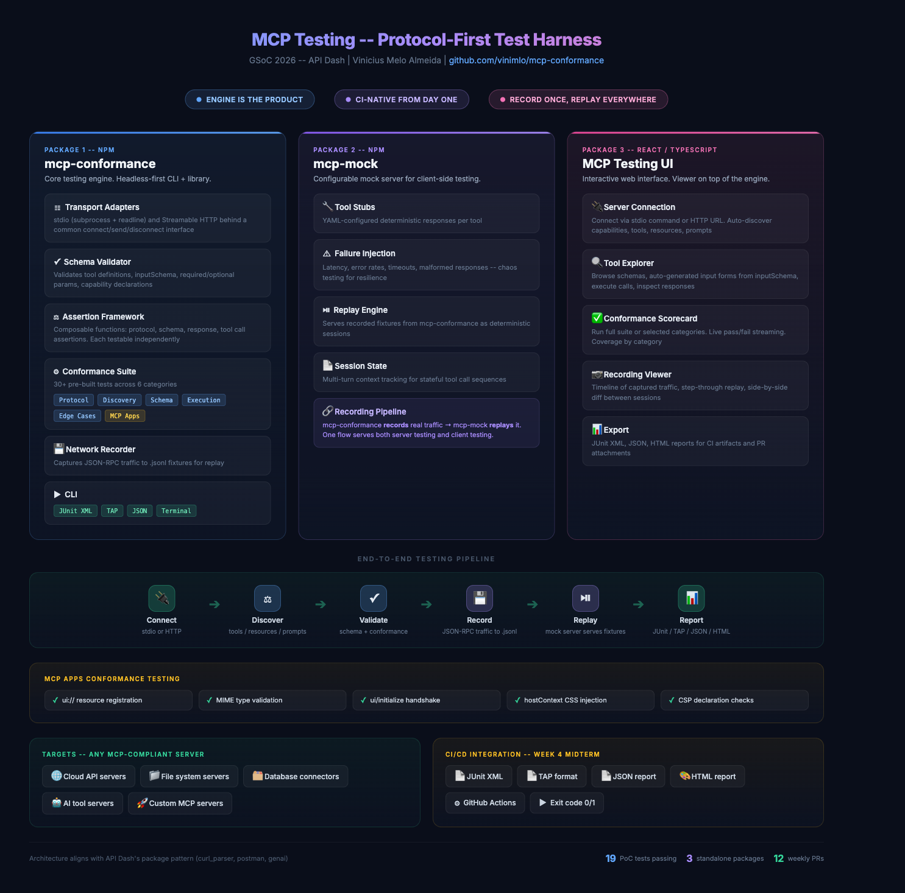

# mcp-conformance

**Protocol-first conformance testing for MCP servers.**


Connects to any MCP server via stdio, runs a suite of conformance tests, and reports pass/fail with CI-ready exit codes. Designed for automation from day one — not a REPL, not a playground, a test harness.

> **Status:** Proof of concept for [GSoC 2026 — API Dash MCP Testing (Idea #1)](https://github.com/foss42/apidash/discussions/1054)

---

## Demo

[](https://asciinema.org/a/qbQRBS3CLtxvFFXW)

Running against a local test fixture (19/19 in 0.4s) and the official MCP SDK reference server `@modelcontextprotocol/server-everything` (19/19 in 1.8s).

---

## What This Proves

This PoC demonstrates that the core architecture works against real MCP servers — not toy mocks:

- **Transport adapter connects to real servers.** The `StdioTransport` spawns a subprocess, exchanges JSON-RPC 2.0 messages over stdin/stdout, and cleanly disconnects. Tested against both a minimal fixture and the official MCP SDK reference server.
- **Composable assertions catch real issues.** Each assertion (`assert`, `assertType`, `assertHasKey`, `assertErrorCode`) is a standalone function. They compose into test cases and produce detailed failure messages.
- **Tested against `@modelcontextprotocol/server-everything`.** The canonical test server shipped with the MCP SDK. This is the same server the MCP team uses to validate the protocol — and the PoC passes 19/19 against it.
- **CI-native from day one.** Exit code 0 on all-pass, 1 on any failure. No flags, no config. Drop it into a GitHub Actions workflow and it works.
- **Protocol-first, not response-first.** Tests verify MCP spec compliance — JSON-RPC 2.0 structure, error codes, capability negotiation, transport lifecycle — not just "did I get a response."
- **Architecture maps 1:1 to the GSoC proposal.** Every module in the PoC (`transport/`, `client.ts`, `assertions.ts`, `suite.ts`, `cli.ts`) scales directly into the corresponding GSoC deliverable.

---

## Spec Ambiguity Discovery

> While testing against the official `server-everything`, the PoC surfaced a real ambiguity in the MCP specification.

**The spec says:** When a client calls an unknown tool, the server should return a JSON-RPC protocol error with code `-32602` (Invalid params).

**What `server-everything` actually does:** Returns a successful JSON-RPC response with `isError: true` in the content — treating it as a tool execution error rather than a protocol error.

**How the PoC handles it:** The unknown-tool test accepts both mechanisms. This isn't a workaround — it's a deliberate design choice. A conformance engine needs to understand the difference between "the spec says X" and "production servers do Y," and test for both.

This is exactly the kind of real-world finding that justifies building dedicated MCP testing tooling.

---

## UI Vision

[](ui-mockup.html)

Proposed MCP Testing UI showing the three-panel layout: server connection (left), protocol log with JSON-RPC message inspector (center), and conformance test runner with pass/fail results (right). Bottom bar shows the conformance scorecard with coverage by category.

Self-contained HTML mockup — [open `ui-mockup.html`](ui-mockup.html) to explore interactively.

---

## Architecture

[](architecture-diagram.html)

```
src/
├── transport/
│   └── stdio.ts          # StdioTransport — spawn subprocess, JSON-RPC over stdin/stdout
├── client.ts             # MCPClient — initialize, tools/list, tools/call, sendRaw
├── assertions.ts         # Composable assertion functions (assert, assertType, assertHasKey, assertErrorCode)
├── suite.ts              # Conformance test suite — 19 tests across 5 categories
└── cli.ts                # CLI entry point — colored output, exit code 0/1
fixtures/
└── test-server.ts        # Minimal MCP server fixture (3 tools: greet, add, echo)
```

### Key Design Decisions

- **Transport adapter interface** — `connect()`, `send()`, `disconnect()` abstracts transport concerns. Adding Streamable HTTP is a new adapter, not a rewrite.
- **Composable assertions** — Pure functions that take a value and throw on failure. Compose them into test cases. No assertion framework dependency.
- **Protocol-first** — Tests verify MCP spec compliance (JSON-RPC 2.0 structure, error codes `-32700`/`-32600`/`-32601`/`-32602`, capability negotiation), not just "does it respond."
- **CI-native** — Exit code 0/1 with no configuration. Output formats (JUnit XML, TAP, JSON) planned for the full version.

---

## Test Coverage

| Category | Tests | What They Verify |
|----------|:-----:|-----------------|
| **Protocol** | 4 | `initialize` returns valid result with `protocolVersion`, `serverInfo`, and `capabilities` object |
| **Discovery** | 1 | `tools/list` returns a valid array of tool definitions |
| **Schema** | 2 | Every tool has `name` + `description`; every tool has a valid `inputSchema` |
| **Execution** | 5 | `tools/call` with valid params succeeds; unknown tool returns error; result contains typed `content` array; every discovered tool is callable; content items have `text` field |
| **Edge Cases** | 7 | Unknown method → error code; duplicate `initialize` is idempotent; concurrent calls resolve independently; extra params don't crash; empty args accepted; JSON-RPC `"2.0"` version field; error responses include `message` |

**Total: 19 tests, 5 categories, 0.4s against fixture, 1.8s against reference server.**

---

## Quick Start

```bash
git clone https://github.com/vinimlo/mcp-conformance.git
cd mcp-conformance
npm install

# Run against the included test fixture
npx tsx src/cli.ts --server "npx tsx fixtures/test-server.ts"

# Run against the official MCP SDK reference server
npx tsx src/cli.ts --server "npx @modelcontextprotocol/server-everything"
```

---

## From PoC to Full Project

Each PoC component is the foundation for a GSoC deliverable — not a throwaway demo.

| PoC Component | Full GSoC Deliverable | Timeline |
|--------------|----------------------|----------|
| `StdioTransport` | + Streamable HTTP adapter | Week 1 |
| `assertions.ts` (4 functions) | Composable assertion framework (protocol, schema, response, tool call) | Week 2 |
| `suite.ts` (19 tests) | 45+ conformance tests covering all 6 MCP primitives | Week 3 |
| `cli.ts` (terminal output) | CLI with JUnit XML, TAP, JSON output | Week 4 |
| — | `mcp-mock`: configurable mock server with replay | Weeks 5–7 |
| `ui-mockup.html` | React web UI: server connection, test runner, recording viewer | Weeks 8–10 |
| — | MCP Apps conformance tests (`ui://`, handshake, CSP) | Week 11 |
| — | Integration tests against 3+ real servers, docs, final report | Week 12 |

The midterm deliverable (Week 4) is `npx mcp-conformance run` working end-to-end with CI output — a direct evolution of what this PoC already does.

---

## GSoC 2026

- **Full Application:** [PR #1476](https://github.com/foss42/apidash/pull/1476)
- **Idea Discussion:** [#1054 — MCP Testing](https://github.com/foss42/apidash/discussions/1054)
- **Author:** [Vinícius Melo](https://github.com/vinimlo)

## License

MIT
